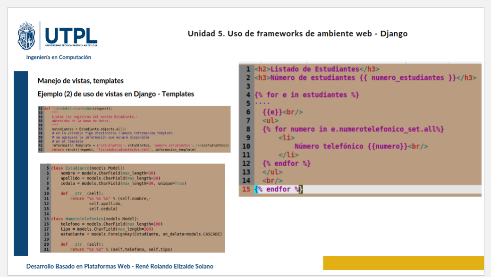

# clase03-2bim

### Explicación de la Imagen
### Que sucede si no tenemos un related name y que podriamos hacer
Cuando no se usa related_name django, pone por defecto el nombre del modelo con _set al final así que para acceder a los datos relacionados, toca usar ese nombre si le pusieras related_name podrías acceder con el nombre que tú elijas y sería más entendible

### 25 junio 2025
En Crear Número Telefónico para un estudiante especifico, ya sabes para quién es el número, no tienes que elegir el estudiante. Por lo que el formulario solo habran 2 campos visibles Telefono, Tipo. Pero el campo del estudiante no sera vacio, solo se oculta 

      input type="hidden" name="estudiante" value="2" id="id_estudiante"

Ya que se tiene guardado el id del estudiante "Luisa Tene"
Esto significa que el número que agregues se asociará automáticamente a Luisa, sin que tú tengas que seleccionarla.

Resumen:
Este formulario: Solo agregas el número y tipo para Luisa Tene (ya está seleccionado).
Formulario con selección: Tú eliges el estudiante antes de agregar el número.